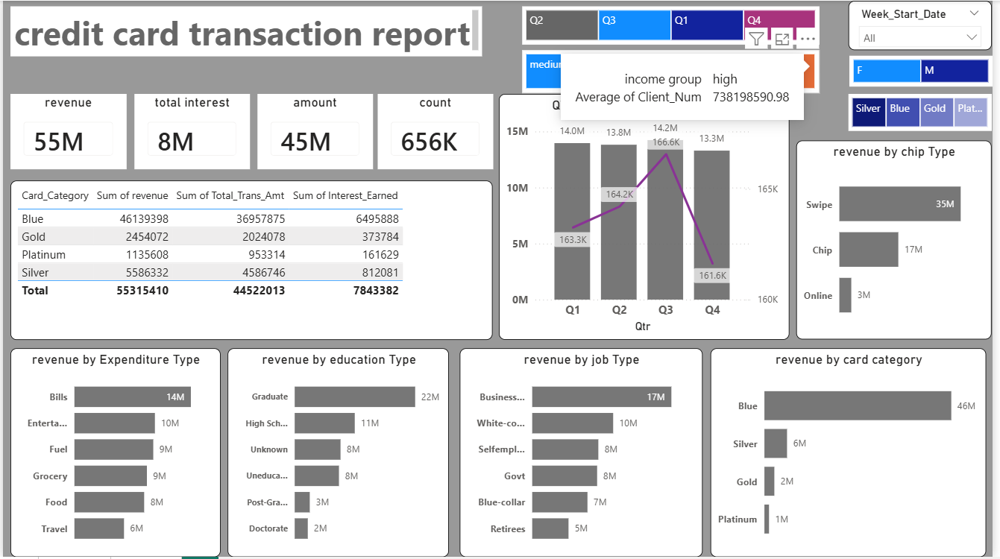
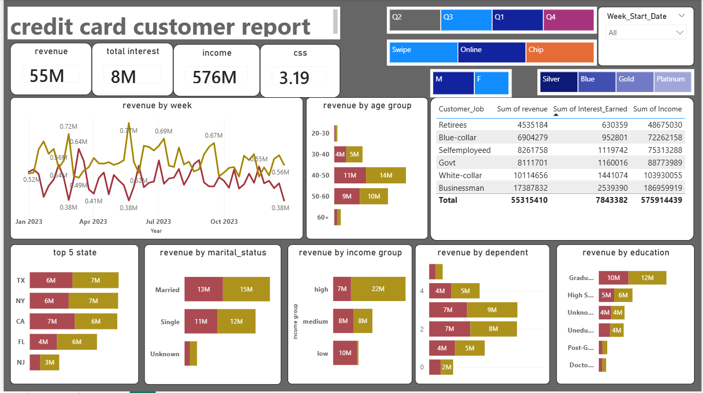

Credit Card Financial Dashboard | Power BI
OBJECTIVE--
To develop a comprehensive credit card weekly dashboard that provide real time insights
into key performance metrics and trends,enabling stakeholders to monitor and analyze credit card operations effectively.

Tools & Technologies--
- Power BI  
- Power Query (ETL & Data Cleaning)  
- DAX (Calculated Measures & KPIs)  
- CSV / Excel Dataset
- 
 Dataset Description
 The dataset includes:
- Credit card transaction details  
- Customer demographics  
- Spending categories  
- Revenue and transaction amounts
- 
  Dashboard Features
- KPI cards for Total Revenue, Total Transactions, and Average Spend  
- Customer segmentation based on spending behavior  
- Category-wise and region-wise revenue analysis  
- Monthly and yearly trend analysis  
- Interactive slicers for dynamic filtering  

- INSIGHTS--
1-Overall revenue is 55M with 8M interest income.
2-Blue and Silver cards contribute more than 90% of revenue, indicating mass-market cards are the key drivers. Premium cards have lower adoption and usage.
3-Customers spend mostly on Bills, Entertainment, Fuel, and Grocery, which shows credit cards are primarily used for essential and recurring expenses.
4-White-collar and medium-income customers generate the highest revenue, suggesting stable salaried users are the most profitable segment.
5-Swipe transactions dominate, while online transactions are comparatively low, highlighting an opportunity to increase digital usage.
6-Activation rate is 57.5%, meaning nearly 42% of issued cards are inactive, which is a revenue leakage area.
7-Delinquency rate is around 6%, which is manageable but needs monitoring in low-income segments.
8-TX, NY, and CA together contribute nearly 70% of revenue, so region-focused campaigns can deliver faster growth.
  
Dashboard Preview
 Credit Card Transaction Dashboard

 Credit Card Customer Dashboard

